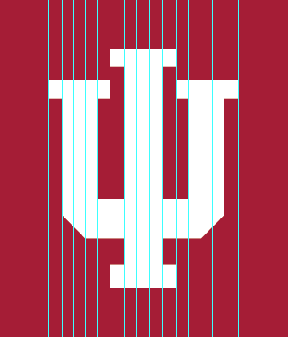
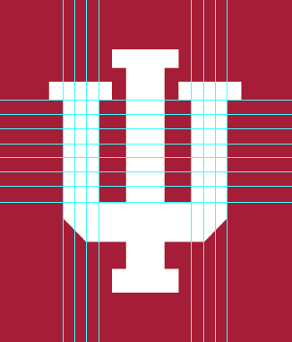

# Reproduction

In this exercise, the [official Block IU art](../prior-art/README.md)
is going to be examined for areas of improvement and reproduced in a way that
follows certain [design principles](principles.md) while remaining faithful
to the original art.

## Designed for print

Upon opening [`iu_tab.eps`](../prior-art/iu_tab.eps), it's apparent for two reasons
that this was designed for print, with little consideration of the web medium.
First, the color mode is set as [CMYK](http://en.wikipedia.org/wiki/CMYK_color_model),
not [RGB](http://en.wikipedia.org/wiki/RGB_color_model). Second, the document
unit is set as [points](http://en.wikipedia.org/wiki/Point_(typography)), not
[pixels](http://en.wikipedia.org/wiki/Pixel).


## Anchor points

Another concern is that the coordinates for all 34 anchor points of the Block IU
contain decimal numbers, rather than whole numbers. Since a monitor can't
physically render anything smaller than a pixel, it fakes these sub-pixels by
applying a blurring technique known as
[anti-aliasing](http://en.wikipedia.org/wiki/Spatial_anti-aliasing).
However, given the predominantly
[rectilinear polygonal](http://en.wikipedia.org/wiki/Rectilinear_polygon)
geometry of the Block IU, the anchor points should snap to whole numbers,
resulting in crisp horizontal and vertical edges.

If `iu_tab.eps` is to the be vector source file from which raster files are to
be generated, it will be impossible to generate crisp edges at the current,
a smaller, or larger scale. By not correcting these misplaced anchor points,
the vector art counteracts the bold strength the
[monogram](http://en.wikipedia.org/wiki/Monogram) is trying to convey.

In order to best illustrate the severity of these decimal anchor points,
an [SVG version](../prior-art/iu_tab.svg) of the original
[EPS file](../prior-art/iu_tab.eps) was generated.

```xml
<?xml version="1.0" encoding="utf-8"?>
<!-- Generator: Adobe Illustrator 16.0.4, SVG Export Plug-In . SVG Version: 6.00 Build 0)  -->
<!DOCTYPE svg PUBLIC "-//W3C//DTD SVG 1.1//EN" "http://www.w3.org/Graphics/SVG/1.1/DTD/svg11.dtd">
<svg version="1.1" id="Layer_1" xmlns="http://www.w3.org/2000/svg" xmlns:xlink="http://www.w3.org/1999/xlink" x="0px" y="0px"
  width="164.840332px" height="191.9111328px" viewBox="0 0 164.840332 191.9111328"
  enable-background="new 0 0 164.840332 191.9111328" xml:space="preserve">
<rect y="-0.2783203" fill="#A41F35" width="164.1489258" height="191.9111328"/>
<polygon fill="#FFFFFF" points="100.3500977,45.8730469 100.3500977,56.0742188 107.4008789,56.0742188 107.4008789,112.8710938
  92.4799805,112.8710938 92.4799805,38.0664062 100.4086914,38.0664062 100.4086914,27.8686523 63.1948242,27.8686523
  63.1948242,38.0664062 71.1274414,38.0664062 71.1274414,112.8710938 56.0385742,112.8710938 56.0385742,56.0742188
  63.0893555,56.0742188 63.0893555,45.8730469 28.081543,45.8730469 28.081543,56.0742188 35.9907227,56.0742188
  35.9907227,121.8457031 48.8588867,134.9775391 71.1274414,134.9775391 71.1274414,150.1386719 63.2250977,150.1386719
  63.2250977,163.2705078 100.3842773,163.2705078 100.3842773,150.1386719 92.4799805,150.1386719 92.4799805,134.9775391
  114.5805664,134.9775391 127.449707,121.8457031 127.449707,56.0742188 135.3754883,56.0742188 135.3754883,45.8730469 "/>
</svg>
```

## Dimensions

If the coordinates of the anchor points should change, then perhaps it's best to
first examine how the `107.294pt × 135.402pt` dimensions of the monogram could
be reimagined as a more reasonable aspect ratio, ideally scalable from a smaller
size.

The most stable aspect of the monogram is the three vertical stems,
dividing the monogram's width into three equal columns. Therefore, if the width
of the art is divisible by three, then there's a higher likelihood of retaining
crisp edges.


By examining closer, we can get a better sense for the intended inner dimensions
of the monogram. Assuming the width of one edge of the
[serif](http://en.wikipedia.org/wiki/Serif) is one unit wide, then the potential
width of the [vertical bar](http://en.wikipedia.org/wiki/Typeface_anatomy) is
either two or three serif-widths wide. However, if the 45-degree raise of the
`U` is to align properly, then three serif-widths wide is the most reasonable
option.



Therefore, if the monogram is to have any chance of working along a horizontal
dimension, then the minimal width of the monogram must be `15 units`.

```
serif-width = 1 unit
vertical-bar-width = 3 units
stem-width = serif-width + vertical-bar-width + serif-width = 5 units
monogram-width = stem-width * 3 = 15 units
```

With a known minimum width of `15 units`, then the minimum height must be
`19 units` to maintain the original aspect ratio.

```
original-ratio = 107.294 / 135.402
original-ratio = 15 / height
height = 15 / original-ratio = 18.929576677 ~= 19
```

## Inner proportions

With minimum dimensions of `15 × 19 units` determined, a series of assumptions
illustrated by horizontal and vertical guides can help derive the inner
proportions of the Block IU from the original `iu_tab.eps` file.

### Assumption 1

Assume all four serifs share the same dimension of `5 × 2 units`.


### Assumption 2

Assume the lower segment of the `I` connecting to the base of the `U` is the
same `2 unit` height of the serifs.


### Assumption 3

Assume the height of the `U` horizontal bar is the same as the `3 unit` width
of the two `U` vertical bars.


### Assumption 4

Based on the aforementioned assumptions, the remaining heights of the `U`
vertical bar should be `7 units`.



### Combining assumptions

Combining these assumptions produces the intended inner proportions of the
monogram at `15 × 19 units`.


## Colors

The [crimson color is defined](http://brand.iu.edu/apply/color.shtml) as the
following, in various color modes:

Color | Pantone | CMYK | RGB
:--|:--|---|---|---
Crimson | 201 | `C0 M100 Y63 K29` | `#7D110C`

`iu_tab.eps` is set in CMYK mode because it's intended for print. When exporting
this print file for the web, the crimson color incorrectly converts to a softer
variation (`#A41F35`), rather than to the intended color (`#7D110C`).
To resolve this, all colors must be set to their intended RGB colors after
setting the document color mode to RGB.

## Illustration

By illustrating the monogram using corrected dimensions, inner proportions, and
colors, the new Block IU (shown first) is significantly improved over its
scaled-down predecessor (shown second).


To better showcase the differences, the artwork is scaled to 10 times the
original size.


With anchor points snapping to whole numbers, the SVG version of the monogram
is simpler and smaller than the original.

```xml
<?xml version="1.0" encoding="utf-8"?>
<!-- Generator: Adobe Illustrator 16.0.4, SVG Export Plug-In . SVG Version: 6.00 Build 0)  -->
<!DOCTYPE svg PUBLIC "-//W3C//DTD SVG 1.1//EN" "http://www.w3.org/Graphics/SVG/1.1/DTD/svg11.dtd">
<svg version="1.1" id="Layer_1" xmlns="http://www.w3.org/2000/svg" xmlns:xlink="http://www.w3.org/1999/xlink" x="0px" y="0px"
   width="25px" height="29px" viewBox="0 0 25 29" enable-background="new 0 0 25 29" xml:space="preserve">
<rect fill="#7D110C" width="25" height="29"/>
<polygon fill="#FFFFFF" points="5,8 5,10 6,10 6,18 8,20 11,20 11,22 10,22 10,24 15,24 15,22 14,22 14,20 17,20 19,18 19,10 20,10
  20,8 15,8 15,10 16,10 16,17 14,17 14,7 15,7 15,5 10,5 10,7 11,7 11,17 9,17 9,10 10,10 10,8 "/>
</svg>
```
