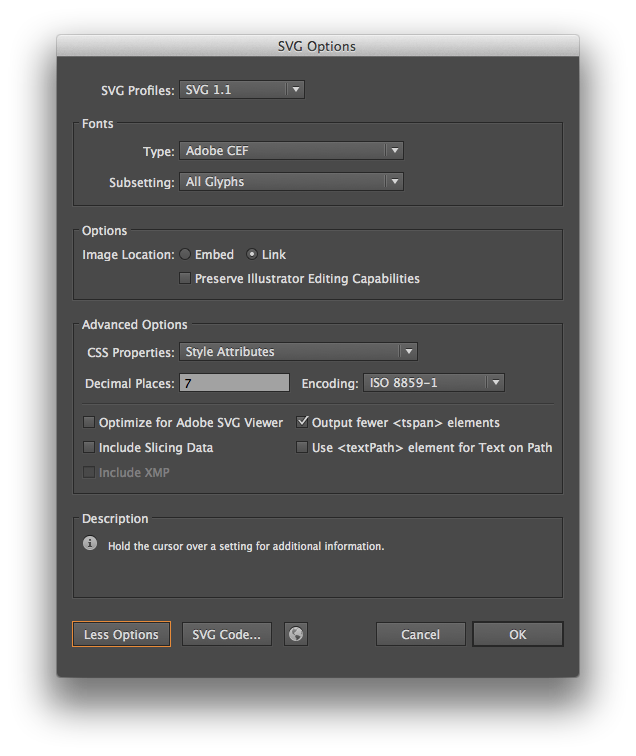

# Prior art

All art was last sourced September 20, 2014.

## block-iu.png

- Width: `22px`
- Height: `26px`
- Source: http://www.iu.edu/_iu-brand/img/block-iu.png
- See: http://www.iu.edu

## favicon.ico

- Width: `16px`
- Height: `16px`
- Source: http://www.iu.edu/favicon.ico
- See: http://www.iu.edu

## iu_tab.eps

- Width: `164.84pt`
- Height: `191.91pt`
- Source: http://brand.iu.edu/downloads/files/iu-tab/iu_tab.zip
- See: http://brand.iu.edu

## iu_tab.svg

- Width: `164.840332px`
- Height: `191.9111328px`

Since the original art did not include a SVG version of the `iu_tab.eps` file,
one was generated for the purposes of this project.
`iu_tab.svg` was generated via Adobe Illustrator CS6, with the following settings:

- `CSS Properties` = `Style Attributes`
- `Decimal Places` = `7`

## trident-tab.png

- Width: `64px`
- Height: `73px`
- Source: http://www.iu.edu/_iu-brand/img/trident-tab.gif
- See: http://www.iu.edu
